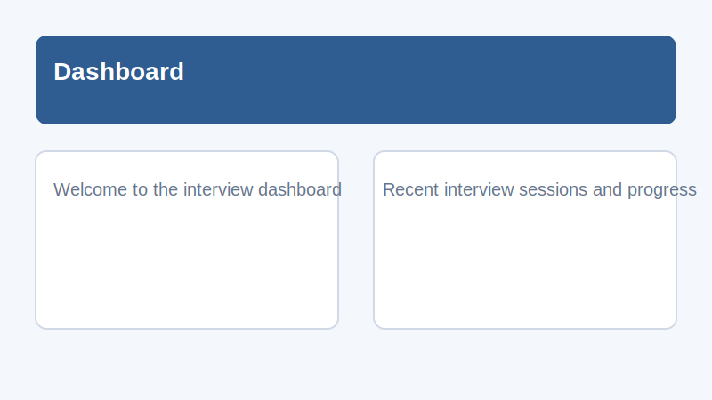
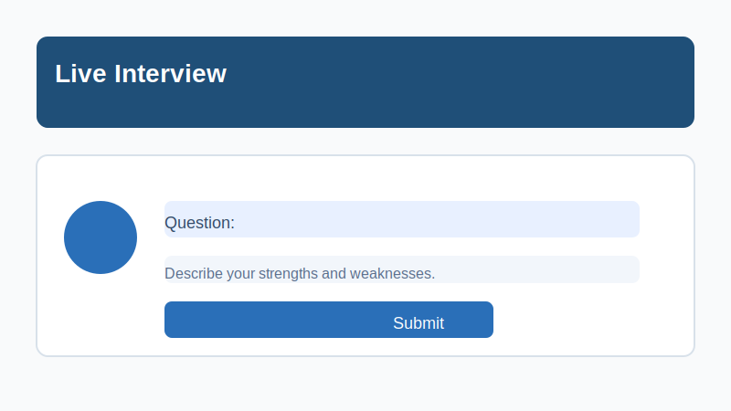
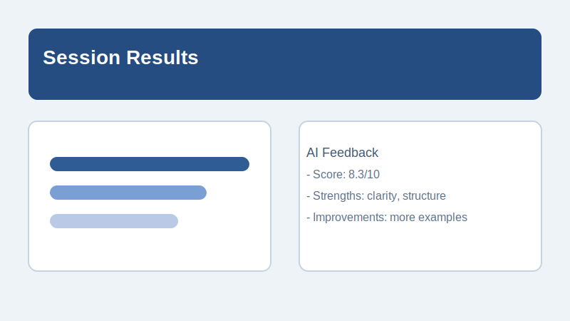

# AI Mock Interview Bot

A Flask-based web application for mock interview practice using an AI assistant. Users can sign up, login, upload resumes, generate interview questions, practice in a session, and review AI-generated feedback.

## Features

- User authentication and dashboard
- Interview session management
- AI-powered question generation and answer evaluation
- Resume upload support for PDF, DOCX, and TXT
- Claude integration via Anthropic API

## Requirements

- Python 3.11+ (recommended)
- Flask
- anthropic
- python-dotenv
- flask-cors
- PyPDF2
- python-docx

Dependencies are listed in `requirements.txt`.

## Installation

1. Clone the repository.
2. Create and activate a virtual environment.
3. Install dependencies:

```bash
python -m venv venv
venv\Scripts\activate
pip install -r requirements.txt
```

## Configuration

Create a `.env` file in the project root or set environment variables directly.

Required values:

```env
SECRET_KEY=your-secret-key
ANTHROPIC_API_KEY=your-anthropic-api-key
```

Optional values:

```env
FLASK_ENV=development
FLASK_DEBUG=1
CLAUDE_MODEL=claude-sonnet-4-20250514
MIN_QUESTIONS=8
MAX_QUESTIONS=12
SESSION_TIMEOUT_MINUTES=120
CLAUDE_MAX_RETRIES=3
CLAUDE_TIMEOUT_SECONDS=45
CLAUDE_MAX_TOKENS=4096
```

## Running the App

Start the Flask server:

```bash
python app.py
```

The app will be available at `http://127.0.0.1:5000`.

## Project Structure

- `app.py` - Flask application factory and routes
- `config.py` - Environment-based configuration
- `database.py` - Database initialization
- `models/` - Data models and user/session helpers
- `routes/` - Flask blueprints for authentication, interview flow, and dashboard
- `services/` - AI integration, resume parsing, question generation, and session handling
- `templates/` - HTML templates for pages
- `static/` - CSS and JavaScript assets

## Demo Screenshots

Below are sample demo screenshots for the application. Replace these images with real screenshots as needed.








## Notes

- This project uses Anthropic Claude for AI responses. Make sure `ANTHROPIC_API_KEY` is valid.
- Uploaded files are limited to 5 MB and supported formats are `pdf`, `docx`, and `txt`.

## License

This repository does not include a license file. Add one if you plan to share or distribute the project.
